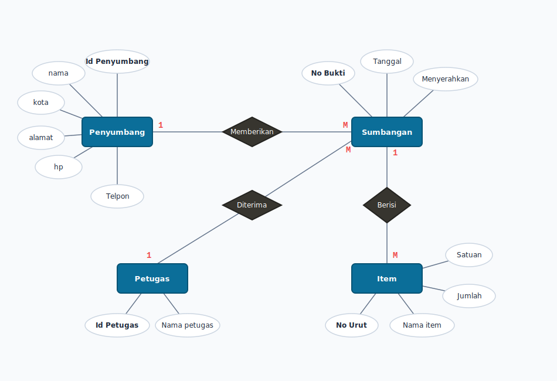
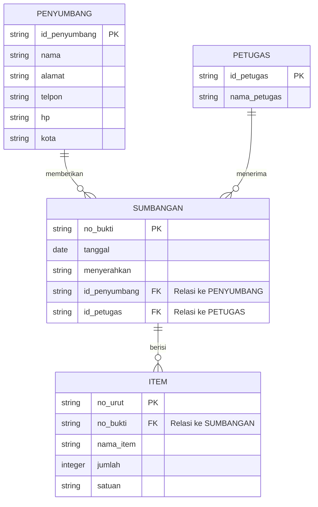
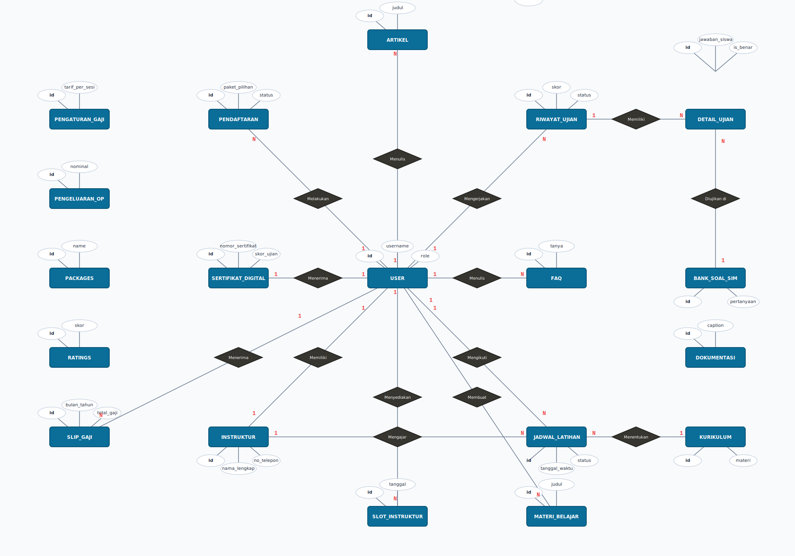
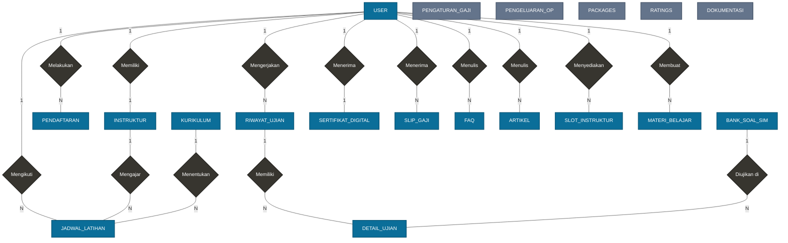

# Entity Relationship Diagram (ERD) - TriBakti Driving School

Dokumen ini berisi representasi **Entity Relationship Diagram (ERD)** untuk sistem basis data **TriBakti Driving School (LPK TriBakti)** yang dianalisis langsung dari kode sumber proyek ini.

Dokumen ini menyediakan:
1. **Diagram Visual (Mermaid.js)** yang dirender otomatis oleh GitHub/VS Code.
2. **Kamus Data & Atribut** lengkap untuk setiap entitas proyek TriBakti.
3. **Analisis Relasi & Kardinalitas**.
4. **Skema DDL SQL (Supabase/PostgreSQL)** asli untuk mempermudah replikasi database.

---

## 1. Diagram Visual Notasi Chen (Klasik)
Berikut adalah diagram visual menggunakan Notasi Chen (persegi panjang untuk entitas, belah ketupat untuk relasi, dan oval untuk atribut) sesuai dengan contoh gaya diagram yang diberikan:

### A. Diagram Sistem Penyumbang & Sumbangan (Sesuai Gambar Referensi)


Berikut adalah **kode Mermaid** untuk sistem Penyumbang & Sumbangan ini:



### B. Diagram Sistem TriBakti Driving School (Proyek Ini)


#### Kode Mermaid Notasi Chen (Dengan Belah Ketupat)
Berikut adalah diagram Notasi Chen yang dirender langsung menggunakan **Mermaid Flowchart** sehingga menampilkan hubungan menggunakan bentuk belah ketupat (`{}`) sesuai dengan standar akademik Anda:



### C. Daftar Relasi Notasi Chen (Bentuk Belah Ketupat)
Untuk membuatnya terlihat sesuai dengan aturan relasi akademik Anda, berikut adalah pemetaan lengkap relasi menggunakan belah ketupat yang menghubungkan entitas-entitas di seluruh 19 tabel basis data Anda:

| Entitas 1 | Relasi (Belah Ketupat) | Entitas 2 | Kardinalitas | Penjelasan |
| :--- | :--- | :--- | :--- | :--- |
| **USER** | Memiliki | **INSTRUKTUR** | $1 : 1$ | Akun pengguna dengan role instruktur memiliki satu data profil instruktur. |
| **USER** | Melakukan | **PENDAFTARAN** | $1 : N$ | Pengguna melakukan pendaftaran belajar mengemudi. |
| **PESERTA (USER)** | Mengikuti | **JADWAL_LATIHAN** | $1 : N$ | Siswa (peserta) mengikuti jadwal latihan mengemudi. |
| **INSTRUKTUR** | Mengajar | **JADWAL_LATIHAN** | $1 : N$ | Instruktur mengajar pada sesi jadwal latihan mengemudi. |
| **KURIKULUM** | Menentukan | **JADWAL_LATIHAN** | $1 : N$ | Kurikulum menentukan materi latihan yang diajarkan pada jadwal latihan. |
| **USER** | Mengerjakan | **RIWAYAT_UJIAN** | $1 : N$ | Siswa mengerjakan ujian simulasi teori atau motorik. |
| **RIWAYAT_UJIAN** | Memiliki | **DETAIL_UJIAN** | $1 : N$ | Setiap lembar ujian memiliki rincian detail jawaban soal. |
| **BANK_SOAL_SIM** | Diujikan di | **DETAIL_UJIAN** | $1 : N$ | Soal-soal dari bank soal diujikan di dalam rincian detail ujian. |
| **USER** | Menerima | **SERTIFIKAT_DIGITAL** | $1 : 1$ | Siswa yang lulus menerima sertifikat digital hasil ujian. |
| **USER** | Menerima | **SLIP_GAJI** | $1 : N$ | Instruktur menerima slip gaji bulanan berdasarkan sesi mengajar. |
| **USER** | Menulis | **FAQ** | $1 : N$ | Administrator menulis atau memperbarui daftar Frequently Asked Questions. |
| **USER** | Menulis | **ARTIKEL** | $1 : N$ | Administrator menulis artikel edukasi/informasi mengemudi. |
| **USER** | Menyediakan | **SLOT_INSTRUKTUR** | $1 : N$ | Instruktur menyediakan slot waktu kosong untuk latihan mengemudi. |
| **USER** | Membuat | **MATERI_BELAJAR** | $1 : N$ | Instruktur membuat materi belajar online berupa video atau artikel. |
| **PENGATURAN_GAJI** | *Standalone* | - | - | Tabel mandiri (konfigurasi tarif dasar sesi mengajar instruktur). |
| **PENGELUARAN_OP** | *Standalone* | - | - | Tabel mandiri (jurnal pencatatan pengeluaran operasional). |
| **PACKAGES** | *Standalone* | - | - | Tabel mandiri (master data paket bimbingan mengemudi). |
| **RATINGS** | *Standalone* | - | - | Tabel mandiri (data ulasan dan skor dari siswa). |
| **DOKUMENTASI** | *Standalone* | - | - | Tabel mandiri (galeri foto dokumentasi kegiatan LPK). |

---

## 2. Diagram Visual Crow's Foot (Mermaid)

```mermaid
erDiagram
    AKUN_PENGGUNA {
        bigint id PK
        string nama_lengkap
        string username
        string password
        string role "siswa, instruktur, admin, owner"
        string paket
        integer price
        integer paket_id
        text alamat_lengkap
        string jenis_kelamin
        string no_whatsapp
        string tempat_tanggal_lahir
        string nik
        integer jumlah_sesi
        timestamp created_at
    }

    INSTRUKTUR {
        bigint id PK
        bigint akun_id FK "Relasi ke akun_pengguna"
        string nama_lengkap
        integer umur
        string no_telepon
        text alamat
        string nama_bank
        string no_rekening
        timestamp created_at
    }

    PENDAFTARAN {
        bigint id PK
        bigint akun_id FK "Relasi ke akun_pengguna"
        string nama_lengkap
        string nik
        string tempat_tanggal_lahir
        string jenis_kelamin
        text alamat_domisili
        string no_whatsapp
        string paket_pilihan
        integer total_bayar
        string bukti_transfer_url
        string status "Menunggu Konfirmasi, Berhasil, Aktif"
        timestamp created_at
    }

    KURIKULUM {
        bigint id PK
        integer pertemuan_ke
        string materi
        timestamp created_at
    }

    JADWAL_LATIHAN {
        bigint id PK
        bigint akun_id FK "Relasi ke akun_pengguna (siswa)"
        bigint instruktur_id FK "Relasi ke akun_pengguna (instruktur)"
        bigint kurikulum_id FK "Relasi ke kurikulum"
        timestamp tanggal_waktu
        integer pertemuan_ke
        string status "Belum Dijadwalkan, Dijadwalkan, Selesai"
        integer nilai
        text catatan_instruktur
        timestamp created_at
    }

    SLOT_INSTRUKTUR {
        bigint id PK
        bigint instruktur_id FK "Relasi ke akun_pengguna (instruktur)"
        date tanggal
        string jam "e.g., 18:00"
        string status "Tersedia, Booked"
        timestamp created_at
    }

    MATERI_PEMBELAJARAN {
        bigint id PK
        bigint akun_id FK "Relasi ke akun_pengguna (instruktur)"
        string judul
        string kategori
        string thumbnail_url
        text deskripsi
        string link_youtube
        timestamp created_at
    }

    BANK_SOAL_SIM {
        bigint id PK
        text pertanyaan
        string pilihan_a
        string pilihan_b
        string pilihan_c
        string pilihan_d
        string kunci_jawaban "A, B, C, D"
        string jenis_ujian "materi, motorik"
        timestamp created_at
    }

    RIWAYAT_UJIAN_SIM {
        bigint id PK
        bigint akun_id FK "Relasi ke akun_pengguna (siswa)"
        integer skor
        integer total_benar
        integer total_salah
        string status "LULUS, TIDAK LULUS"
        string jenis_ujian
        timestamp created_at
    }

    DETAIL_UJIAN_SOAL {
        bigint id PK
        bigint riwayat_ujian_id FK "Relasi ke riwayat_ujian_sim"
        bigint soal_id FK "Relasi ke bank_soal_sim"
        string jawaban_siswa
        boolean is_benar
        timestamp created_at
    }

    SERTIFIKAT_DIGITAL {
        bigint id PK
        bigint akun_id FK "Relasi ke akun_pengguna (siswa)"
        string nomor_sertifikat
        timestamp tanggal_terbit
        integer skor_ujian
        string url_gambar
        timestamp created_at
    }

    SLIP_GAJI_INSTRUKTUR {
        bigint id PK
        bigint instruktur_id FK "Relasi ke akun_pengguna (instruktur)"
        string bulan_tahun "YYYY-MM"
        integer jumlah_sesi
        integer tarif_per_sesi
        integer total_gaji
        string status_pembayaran "Belum Dibayar, Lunas"
        timestamp tanggal_bayar
        string bukti_pembayaran_url
        text catatan
        timestamp created_at
        timestamp updated_at
    }

    PENGATURAN_GAJI {
        bigint id PK
        integer tarif_per_sesi
        timestamp created_at
        timestamp updated_at
    }

    PENGELUARAN_OPERASIONAL {
        bigint id PK
        date tanggal
        string kategori
        integer nominal
        text keterangan
        string bukti_url
        timestamp created_at
    }

    PACKAGES {
        bigint id PK
        string name
        integer price
        string label
        integer session_count
        text description
        string features
    }

    FAQ {
        bigint id PK
        text tanya
        text jawab
        bigint created_by FK "Relasi ke akun_pengguna (admin)"
        timestamp created_at
    }

    ARTIKEL {
        bigint id PK
        string judul
        date tanggal
        string gambar_url
        text excerpt
        text full_text
        bigint created_by FK "Relasi ke akun_pengguna (admin)"
        timestamp created_at
    }

    RATINGS {
        bigint id PK
        string nama_siswa
        string paket_siswa
        integer skor
        text ulasan
        timestamp created_at
    }

    DOKUMENTASI {
        bigint id PK
        string gambar_url
        text caption
        timestamp created_at
    }

    %% Definisi Relasi
    AKUN_PENGGUNA ||--o{ PENDAFTARAN : "Relasi ke akun_pengguna"
    AKUN_PENGGUNA ||--o| INSTRUKTUR : "Relasi ke akun_pengguna"
    AKUN_PENGGUNA ||--o{ JADWAL_LATIHAN : "Relasi ke akun_pengguna (siswa)"
    AKUN_PENGGUNA ||--o{ JADWAL_LATIHAN : "Relasi ke akun_pengguna (instruktur)"
    AKUN_PENGGUNA ||--o{ SLOT_INSTRUKTUR : "Relasi ke akun_pengguna (instruktur)"
    AKUN_PENGGUNA ||--o{ MATERI_PEMBELAJARAN : "Relasi ke akun_pengguna (instruktur)"
    AKUN_PENGGUNA ||--o{ RIWAYAT_UJIAN_SIM : "Relasi ke akun_pengguna (siswa)"
    
    KURIKULUM ||..o{ JADWAL_LATIHAN : "Relasi ke kurikulum"
    RIWAYAT_UJIAN_SIM ||--|{ DETAIL_UJIAN_SOAL : "Relasi ke riwayat_ujian_sim"
    BANK_SOAL_SIM ||--o{ DETAIL_UJIAN_SOAL : "Relasi ke bank_soal_sim"

    AKUN_PENGGUNA ||--o| SERTIFIKAT_DIGITAL : "Relasi ke akun_pengguna (siswa)"
    AKUN_PENGGUNA ||--o{ SLIP_GAJI_INSTRUKTUR : "Relasi ke akun_pengguna (instruktur)"
    AKUN_PENGGUNA ||--o{ FAQ : "Relasi ke akun_pengguna (admin)"
    AKUN_PENGGUNA ||--o{ ARTIKEL : "Relasi ke akun_pengguna (admin)"
```



---

## 2. Kamus Data & Atribut Tabel

### 1. AKUN_PENGGUNA
Tabel utama otentikasi dan profil akun multi-role.
- `id` (BIGINT, PK): ID unik user.
- `nama_lengkap` (VARCHAR): Nama lengkap pengguna.
- `username` (VARCHAR, UNIQUE): Username untuk login.
- `password` (VARCHAR): Password rahasia.
- `role` (VARCHAR): Role pengguna (`'siswa'`, `'instruktur'`, `'admin'`, `'owner'`).
- `paket`, `price`, `paket_id`, `jumlah_sesi`: Data paket yang sedang diambil (khusus siswa).
- `alamat_lengkap`, `jenis_kelamin`, `no_whatsapp`, `tempat_tanggal_lahir`, `nik`: Informasi biodata pengguna.

### 2. INSTRUKTUR
Data profil tambahan untuk akun ber-role `'instruktur'`.
- `id` (BIGINT, PK): ID unik instruktur.
- `akun_id` (BIGINT, FK): Menghubungkan ke `akun_pengguna(id)`.
- `nama_lengkap` (VARCHAR): Nama lengkap instruktur.
- `umur` (INTEGER): Usia pengajar.
- `no_telepon` (VARCHAR): Nomor kontak pengajar.
- `alamat` (TEXT): Domisili lengkap.
- `nama_bank`, `no_rekening`: Data perbankan untuk transfer gaji bulanan.

### 3. PENDAFTARAN
Log formulir pendaftaran awal dan bukti transfer siswa.
- `id` (BIGINT, PK): ID unik pendaftaran.
- `akun_id` (BIGINT, FK): Akun siswa pemohon.
- `bukti_transfer_url` (TEXT): File unggahan bukti transfer biaya kursus.
- `status` (VARCHAR): Status pendaftaran (`'Menunggu Konfirmasi'`, `'Berhasil'`).

### 4. KURIKULUM
Data master kurikulum pertemuan latihan praktik mengemudi.
- `id` (BIGINT, PK): ID kurikulum.
- `pertemuan_ke` (INTEGER): Urutan pertemuan (1 s.d 11).
- `materi` (VARCHAR): Materi pelajaran praktik (misal: "Teknik Tanjakan").

### 5. JADWAL_LATIHAN
Penjadwalan dinamis antara Siswa, Instruktur, dan Kurikulum.
- `id` (BIGINT, PK): ID jadwal.
- `akun_id` (BIGINT, FK): ID Siswa.
- `instruktur_id` (BIGINT, FK): ID Instruktur pengajar.
- `kurikulum_id` (BIGINT, FK): Materi kurikulum yang diajarkan.
- `tanggal_waktu` (TIMESTAMP): Waktu pelaksanaan latihan praktik.
- `status` (VARCHAR): Status sesi (`'Belum Dijadwalkan'`, `'Dijadwalkan'`, `'Selesai'`).
- `nilai` (INTEGER): Penilaian skor latihan.
- `catatan_instruktur` (TEXT): Evaluasi dari instruktur.

### 6. SLOT_INSTRUKTUR
Kalender ketersediaan jam mengajar instruktur.
- `id` (BIGINT, PK): ID slot jam.
- `instruktur_id` (BIGINT, FK): Instruktur bersangkutan.
- `tanggal` (DATE): Tanggal bertugas.
- `jam` (VARCHAR): Jam bertugas (misal: `'08:00'`).
- `status` (VARCHAR): Status ketersediaan (`'Tersedia'`, `'Booked'`).

### 7. MATERI_PEMBELAJARAN
Katalog modul belajar online berupa artikel & video Youtube.
- `id` (BIGINT, PK): ID materi.
- `akun_id` (BIGINT, FK): Instruktur kontributor.
- `judul`, `kategori`, `deskripsi` (TEXT): Data teks modul.
- `thumbnail_url`, `link_youtube`: Link cover & media video.

### 8. BANK_SOAL_SIM
Soal ujian simulasi SIM (Teori / Motorik).
- `id` (BIGINT, PK): ID soal.
- `pertanyaan` (TEXT): Kalimat soal.
- `pilihan_a`, `pilihan_b`, `pilihan_c`, `pilihan_d`: Opsi jawaban ganda.
- `kunci_jawaban` (VARCHAR): Jawaban benar (`'A'`, `'B'`, `'C'`, `'D'`).
- `jenis_ujian` (VARCHAR): Kategori ujian (`'materi'`, `'motorik'`).

### 9. RIWAYAT_UJIAN_SIM
Log hasil lembar ujian simulasi siswa.
- `id` (BIGINT, PK): ID riwayat ujian.
- `akun_id` (BIGINT, FK): ID Siswa pengerja.
- `skor` (INTEGER): Skor akhir (0 - 100).
- `status` (VARCHAR): Kelulusan (`'LULUS'`, `'TIDAK LULUS'`).

### 10. DETAIL_UJIAN_SOAL
Rincian jawaban siswa untuk setiap butir soal dalam lembar ujian.
- `riwayat_ujian_id` (BIGINT, FK): ID riwayat ujian.
- `soal_id` (BIGINT, FK): ID soal yang dikerjakan.
- `jawaban_siswa` (VARCHAR): Jawaban yang dipilih siswa.
- `is_benar` (BOOLEAN): Status kebenaran jawaban.

### 11. SERTIFIKAT_DIGITAL
Sertifikat kompetensi kelulusan siswa yang diunggah ke cloud.
- `id` (BIGINT, PK): ID sertifikat.
- `akun_id` (BIGINT, FK): ID Siswa penerima.
- `nomor_sertifikat` (VARCHAR, UNIQUE): Nomor kode unik sertifikat.
- `url_gambar` (TEXT): Link file gambar sertifikat (.png) di Supabase Storage.

### 12. SLIP_GAJI_INSTRUKTUR & PENGATURAN_GAJI
Finansial dan payroll untuk gaji instruktur.
- `tarif_per_sesi` (INTEGER): Nominal gaji flat mengajar per satu sesi.
- `total_gaji` (INTEGER): Hasil kali dari `jumlah_sesi` * `tarif_per_sesi`.
- `status_pembayaran` (VARCHAR): Status payroll (`'Belum Dibayar'`, `'Lunas'`).

### 13. PENGELUARAN_OPERASIONAL
Jurnal pengeluaran operasional sekolah mengemudi TriBakti (bensin, ban, servis, dll).

---

## 3. Skema DDL SQL (Supabase/PostgreSQL)

Berikut adalah script SQL DDL lengkap untuk mereplikasi database TriBakti Anda:

```sql
-- Mengaktifkan ekstensi UUID generator
CREATE EXTENSION IF NOT EXISTS "uuid-ossp";

-- 1. Tabel AKUN_PENGGUNA
CREATE TABLE public.akun_pengguna (
    id BIGINT PRIMARY KEY GENERATED BY DEFAULT AS IDENTITY,
    nama_lengkap VARCHAR(255) NOT NULL,
    username VARCHAR(100) UNIQUE NOT NULL,
    password VARCHAR(255) NOT NULL,
    role VARCHAR(50) NOT NULL CHECK (role IN ('siswa', 'instruktur', 'admin', 'owner')),
    paket VARCHAR(150),
    price INTEGER DEFAULT 0,
    paket_id INTEGER,
    alamat_lengkap TEXT,
    jenis_kelamin VARCHAR(50),
    no_whatsapp VARCHAR(50),
    tempat_tanggal_lahir VARCHAR(255),
    nik VARCHAR(50),
    jumlah_sesi INTEGER DEFAULT 0,
    created_at TIMESTAMP WITH TIME ZONE DEFAULT timezone('utc'::text, now()) NOT NULL
);

-- 2. Tabel INSTRUKTUR
CREATE TABLE public.instruktur (
    id BIGINT PRIMARY KEY GENERATED BY DEFAULT AS IDENTITY,
    akun_id BIGINT UNIQUE NOT NULL,
    nama_lengkap VARCHAR(255) NOT NULL,
    umur INTEGER NOT NULL,
    no_telepon VARCHAR(50) NOT NULL,
    alamat TEXT NOT NULL,
    nama_bank VARCHAR(100),
    no_rekening VARCHAR(100),
    created_at TIMESTAMP WITH TIME ZONE DEFAULT timezone('utc'::text, now()) NOT NULL,
    CONSTRAINT "Relasi ke akun_pengguna" FOREIGN KEY (akun_id) REFERENCES public.akun_pengguna(id) ON DELETE CASCADE
);

-- 3. Tabel PENDAFTARAN
CREATE TABLE public.pendaftaran (
    id BIGINT PRIMARY KEY GENERATED BY DEFAULT AS IDENTITY,
    akun_id BIGINT NOT NULL,
    nama_lengkap VARCHAR(255) NOT NULL,
    nik VARCHAR(50) NOT NULL,
    tempat_tanggal_lahir VARCHAR(255) NOT NULL,
    jenis_kelamin VARCHAR(50) NOT NULL,
    alamat_domisili TEXT NOT NULL,
    no_whatsapp VARCHAR(50) NOT NULL,
    paket_pilihan VARCHAR(150) NOT NULL,
    total_bayar INTEGER NOT NULL,
    bukti_transfer_url TEXT NOT NULL,
    status VARCHAR(100) DEFAULT 'Menunggu Konfirmasi' NOT NULL,
    created_at TIMESTAMP WITH TIME ZONE DEFAULT timezone('utc'::text, now()) NOT NULL,
    CONSTRAINT "Relasi ke akun_pengguna" FOREIGN KEY (akun_id) REFERENCES public.akun_pengguna(id) ON DELETE CASCADE
);

-- 4. Tabel KURIKULUM
CREATE TABLE public.kurikulum (
    id BIGINT PRIMARY KEY GENERATED BY DEFAULT AS IDENTITY,
    pertemuan_ke INTEGER NOT NULL UNIQUE,
    materi VARCHAR(255) NOT NULL,
    created_at TIMESTAMP WITH TIME ZONE DEFAULT timezone('utc'::text, now()) NOT NULL
);

-- 5. Tabel JADWAL_LATIHAN
CREATE TABLE public.jadwal_latihan (
    id BIGINT PRIMARY KEY GENERATED BY DEFAULT AS IDENTITY,
    akun_id BIGINT,
    instruktur_id BIGINT,
    kurikulum_id BIGINT,
    tanggal_waktu TIMESTAMP WITH TIME ZONE,
    pertemuan_ke INTEGER NOT NULL,
    status VARCHAR(100) DEFAULT 'Belum Dijadwalkan' NOT NULL,
    nilai INTEGER,
    catatan_instruktur TEXT,
    created_at TIMESTAMP WITH TIME ZONE DEFAULT timezone('utc'::text, now()) NOT NULL,
    CONSTRAINT "Relasi ke akun_pengguna (siswa)" FOREIGN KEY (akun_id) REFERENCES public.akun_pengguna(id) ON DELETE CASCADE,
    CONSTRAINT "Relasi ke akun_pengguna (instruktur)" FOREIGN KEY (instruktur_id) REFERENCES public.akun_pengguna(id) ON DELETE SET NULL,
    CONSTRAINT "Relasi ke kurikulum" FOREIGN KEY (kurikulum_id) REFERENCES public.kurikulum(id) ON DELETE SET NULL
);

-- 6. Tabel SLOT_INSTRUKTUR
CREATE TABLE public.slot_instruktur (
    id BIGINT PRIMARY KEY GENERATED BY DEFAULT AS IDENTITY,
    instruktur_id BIGINT NOT NULL,
    tanggal DATE NOT NULL,
    jam VARCHAR(10) NOT NULL,
    status VARCHAR(50) DEFAULT 'Tersedia' NOT NULL CHECK (status IN ('Tersedia', 'Booked')),
    created_at TIMESTAMP WITH TIME ZONE DEFAULT timezone('utc'::text, now()) NOT NULL,
    CONSTRAINT "Relasi ke akun_pengguna (instruktur)" FOREIGN KEY (instruktur_id) REFERENCES public.akun_pengguna(id) ON DELETE CASCADE
);

-- 7. Tabel MATERI_PEMBELAJARAN
CREATE TABLE public.materi_pembelajaran (
    id BIGINT PRIMARY KEY GENERATED BY DEFAULT AS IDENTITY,
    akun_id BIGINT,
    judul VARCHAR(255) NOT NULL,
    kategori VARCHAR(150) NOT NULL,
    thumbnail_url TEXT NOT NULL,
    deskripsi TEXT,
    link_youtube TEXT,
    created_at TIMESTAMP WITH TIME ZONE DEFAULT timezone('utc'::text, now()) NOT NULL,
    CONSTRAINT "Relasi ke akun_pengguna (instruktur)" FOREIGN KEY (akun_id) REFERENCES public.akun_pengguna(id) ON DELETE SET NULL
);

-- 8. Tabel BANK_SOAL_SIM
CREATE TABLE public.bank_soal_sim (
    id BIGINT PRIMARY KEY GENERATED BY DEFAULT AS IDENTITY,
    pertanyaan TEXT NOT NULL,
    pilihan_a VARCHAR(255) NOT NULL,
    pilihan_b VARCHAR(255) NOT NULL,
    pilihan_c VARCHAR(255) NOT NULL,
    pilihan_d VARCHAR(255) NOT NULL,
    kunci_jawaban VARCHAR(10) NOT NULL CHECK (kunci_jawaban IN ('A', 'B', 'C', 'D')),
    jenis_ujian VARCHAR(50) NOT NULL CHECK (jenis_ujian IN ('materi', 'motorik')),
    created_at TIMESTAMP WITH TIME ZONE DEFAULT timezone('utc'::text, now()) NOT NULL
);

-- 9. Tabel RIWAYAT_UJIAN_SIM
CREATE TABLE public.riwayat_ujian_sim (
    id BIGINT PRIMARY KEY GENERATED BY DEFAULT AS IDENTITY,
    akun_id BIGINT NOT NULL,
    skor INTEGER NOT NULL,
    total_benar INTEGER NOT NULL,
    total_salah INTEGER NOT NULL,
    status VARCHAR(50) NOT NULL CHECK (status IN ('LULUS', 'TIDAK LULUS')),
    jenis_ujian VARCHAR(50) NOT NULL,
    created_at TIMESTAMP WITH TIME ZONE DEFAULT timezone('utc'::text, now()) NOT NULL,
    CONSTRAINT "Relasi ke akun_pengguna (siswa)" FOREIGN KEY (akun_id) REFERENCES public.akun_pengguna(id) ON DELETE CASCADE
);

-- 10. Tabel DETAIL_UJIAN_SOAL
CREATE TABLE public.detail_ujian_soal (
    id BIGINT PRIMARY KEY GENERATED BY DEFAULT AS IDENTITY,
    riwayat_ujian_id BIGINT NOT NULL,
    soal_id BIGINT NOT NULL,
    jawaban_siswa VARCHAR(10),
    is_benar BOOLEAN NOT NULL,
    created_at TIMESTAMP WITH TIME ZONE DEFAULT timezone('utc'::text, now()) NOT NULL,
    CONSTRAINT "Relasi ke riwayat_ujian_sim" FOREIGN KEY (riwayat_ujian_id) REFERENCES public.riwayat_ujian_sim(id) ON DELETE CASCADE,
    CONSTRAINT "Relasi ke bank_soal_sim" FOREIGN KEY (soal_id) REFERENCES public.bank_soal_sim(id) ON DELETE CASCADE
);

-- 11. Tabel SERTIFIKAT_DIGITAL
CREATE TABLE public.sertifikat_digital (
    id BIGINT PRIMARY KEY GENERATED BY DEFAULT AS IDENTITY,
    akun_id BIGINT NOT NULL,
    nomor_sertifikat VARCHAR(100) UNIQUE NOT NULL,
    tanggal_terbit TIMESTAMP WITH TIME ZONE NOT NULL,
    skor_ujian INTEGER NOT NULL,
    url_gambar TEXT,
    created_at TIMESTAMP WITH TIME ZONE DEFAULT timezone('utc'::text, now()) NOT NULL,
    CONSTRAINT "Relasi ke akun_pengguna (siswa)" FOREIGN KEY (akun_id) REFERENCES public.akun_pengguna(id) ON DELETE CASCADE
);

-- 12. Tabel PENGATURAN_GAJI
CREATE TABLE public.pengaturan_gaji (
    id BIGINT PRIMARY KEY GENERATED BY DEFAULT AS IDENTITY,
    tarif_per_sesi INTEGER NOT NULL DEFAULT 50000,
    created_at TIMESTAMP WITH TIME ZONE DEFAULT timezone('utc'::text, now()) NOT NULL,
    updated_at TIMESTAMP WITH TIME ZONE DEFAULT timezone('utc'::text, now()) NOT NULL
);

-- 13. Tabel SLIP_GAJI_INSTRUKTUR
CREATE TABLE public.slip_gaji_instruktur (
    id BIGINT PRIMARY KEY GENERATED BY DEFAULT AS IDENTITY,
    instruktur_id BIGINT NOT NULL,
    bulan_tahun VARCHAR(7) NOT NULL,
    jumlah_sesi INTEGER NOT NULL DEFAULT 0,
    tarif_per_sesi INTEGER NOT NULL DEFAULT 0,
    total_gaji INTEGER NOT NULL DEFAULT 0,
    status_pembayaran VARCHAR(50) DEFAULT 'Belum Dibayar' NOT NULL CHECK (status_pembayaran IN ('Belum Dibayar', 'Lunas')),
    tanggal_bayar TIMESTAMP WITH TIME ZONE,
    bukti_pembayaran_url TEXT,
    catatan TEXT,
    created_at TIMESTAMP WITH TIME ZONE DEFAULT timezone('utc'::text, now()) NOT NULL,
    updated_at TIMESTAMP WITH TIME ZONE DEFAULT timezone('utc'::text, now()) NOT NULL,
    CONSTRAINT unique_instruktur_periode UNIQUE (instruktur_id, bulan_tahun),
    CONSTRAINT "Relasi ke akun_pengguna (instruktur)" FOREIGN KEY (instruktur_id) REFERENCES public.akun_pengguna(id) ON DELETE CASCADE
);

-- 14. Tabel PENGELUARAN_OPERASIONAL
CREATE TABLE public.pengeluaran_operasional (
    id BIGINT PRIMARY KEY GENERATED BY DEFAULT AS IDENTITY,
    tanggal DATE NOT NULL,
    kategori VARCHAR(150) NOT NULL,
    nominal INTEGER NOT NULL,
    keterangan TEXT,
    bukti_url TEXT,
    created_at TIMESTAMP WITH TIME ZONE DEFAULT timezone('utc'::text, now()) NOT NULL
);

-- 15. Tabel PACKAGES
CREATE TABLE public.packages (
    id BIGINT PRIMARY KEY GENERATED BY DEFAULT AS IDENTITY,
    name VARCHAR(255) NOT NULL,
    price INTEGER NOT NULL,
    label VARCHAR(100),
    session_count INTEGER NOT NULL,
    description TEXT,
    features TEXT[],
    created_at TIMESTAMP WITH TIME ZONE DEFAULT timezone('utc'::text, now()) NOT NULL
);

-- 16. Tabel FAQ
CREATE TABLE public.faq (
    id BIGINT PRIMARY KEY GENERATED BY DEFAULT AS IDENTITY,
    tanya TEXT NOT NULL,
    jawab TEXT NOT NULL,
    created_by BIGINT,
    created_at TIMESTAMP WITH TIME ZONE DEFAULT timezone('utc'::text, now()) NOT NULL,
    CONSTRAINT "Relasi ke akun_pengguna (admin)" FOREIGN KEY (created_by) REFERENCES public.akun_pengguna(id) ON DELETE SET NULL
);

-- 17. Tabel ARTIKEL
CREATE TABLE public.artikel (
    id BIGINT PRIMARY KEY GENERATED BY DEFAULT AS IDENTITY,
    judul VARCHAR(255) NOT NULL,
    tanggal DATE NOT NULL,
    gambar_url TEXT,
    excerpt TEXT,
    full_text TEXT NOT NULL,
    created_by BIGINT,
    created_at TIMESTAMP WITH TIME ZONE DEFAULT timezone('utc'::text, now()) NOT NULL,
    CONSTRAINT "Relasi ke akun_pengguna (admin)" FOREIGN KEY (created_by) REFERENCES public.akun_pengguna(id) ON DELETE SET NULL
);

-- 18. Tabel RATINGS
CREATE TABLE public.ratings (
    id BIGINT PRIMARY KEY GENERATED BY DEFAULT AS IDENTITY,
    nama_siswa VARCHAR(255) NOT NULL,
    paket_siswa VARCHAR(150) NOT NULL,
    skor INTEGER NOT NULL CHECK (skor >= 1 AND skor <= 5),
    ulasan TEXT NOT NULL,
    created_at TIMESTAMP WITH TIME ZONE DEFAULT timezone('utc'::text, now()) NOT NULL
);

-- 19. Tabel DOKUMENTASI
CREATE TABLE public.dokumentasi (
    id BIGINT PRIMARY KEY GENERATED BY DEFAULT AS IDENTITY,
    gambar_url TEXT NOT NULL,
    caption TEXT,
    created_at TIMESTAMP WITH TIME ZONE DEFAULT timezone('utc'::text, now()) NOT NULL
);
```

---

## 4. Contoh Data Dummy (SQL INSERT)

Berikut adalah skrip SQL untuk memasukkan data sampel (dummy data) ke seluruh 19 tabel Anda. Skrip ini sudah disesuaikan dengan nilai foreign key yang saling merujuk:

```sql
-- 1. AKUN_PENGGUNA
INSERT INTO public.akun_pengguna (nama_lengkap, username, password, role, paket, price, paket_id, alamat_lengkap, jenis_kelamin, no_whatsapp, tempat_tanggal_lahir, nik, jumlah_sesi) VALUES
('Budi Santoso', 'budi_siswa', 'pbkdf2_sha256$siswa123', 'siswa', 'Paket Mobil Manual (A)', 1500000, 1, 'Jl. Mawar No. 12, Jakarta', 'Laki-laki', '081234567890', 'Jakarta, 12 April 2005', '3171012345670001', 11),
('Joko Widodo', 'joko_instruktur', 'pbkdf2_sha256$instruktur123', 'instruktur', NULL, 0, NULL, 'Jl. Melati No. 4, Jakarta', 'Laki-laki', '081234567891', 'Solo, 21 Juni 1961', '3372012345670002', 0),
('Siti Aminah', 'siti_admin', 'pbkdf2_sha256$admin123', 'admin', NULL, 0, NULL, 'Jl. Anggrek No. 8, Jakarta', 'Perempuan', '081234567892', 'Surabaya, 15 Mei 1990', '3578012345670003', 0),
('Hendra Wijaya', 'hendra_owner', 'pbkdf2_sha256$owner123', 'owner', NULL, 0, NULL, 'Jl. Kamboja No. 1, Jakarta', 'Laki-laki', '081234567893', 'Bandung, 10 Oktober 1980', '3273012345670004', 0);

-- 2. INSTRUKTUR
-- Catatan: akun_id = 2 merujuk pada 'joko_instruktur'
INSERT INTO public.instruktur (akun_id, nama_lengkap, umur, no_telepon, alamat, nama_bank, no_rekening) VALUES
(2, 'Joko Widodo', 65, '081234567891', 'Jl. Melati No. 4, Jakarta', 'Bank Mandiri', '1234567890');

-- 3. PENDAFTARAN
-- Catatan: akun_id = 1 merujuk pada 'budi_siswa'
INSERT INTO public.pendaftaran (akun_id, nama_lengkap, nik, tempat_tanggal_lahir, jenis_kelamin, alamat_domisili, no_whatsapp, paket_pilihan, total_bayar, bukti_transfer_url, status) VALUES
(1, 'Budi Santoso', '3171012345670001', 'Jakarta, 12 April 2005', 'Laki-laki', 'Jl. Mawar No. 12, Jakarta', '081234567890', 'Paket Mobil Manual (A)', 1500000, 'https://supabase.storage/bukti_tf_budi.jpg', 'Berhasil');

-- 4. KURIKULUM
INSERT INTO public.kurikulum (pertemuan_ke, materi) VALUES
(1, 'Pengenalan Dashboard & Pedal Mobil'),
(2, 'Teknik Menyetir Jalan Lurus & Zig-zag'),
(3, 'Teknik Tanjakan & Turunan (Handbrake)'),
(4, 'Teknik Parkir Seri & Paralel');

-- 5. JADWAL_LATIHAN
-- Catatan: akun_id = 1 (siswa Budi), instruktur_id = 2 (instruktur Joko), kurikulum_id = 1
INSERT INTO public.jadwal_latihan (akun_id, instruktur_id, kurikulum_id, tanggal_waktu, pertemuan_ke, status, nilai, catatan_instruktur) VALUES
(1, 2, 1, '2026-06-25 09:00:00+07', 1, 'Selesai', 85, 'Penguasaan pedal gas dan kopling sudah cukup stabil.');

-- 6. SLOT_INSTRUKTUR
-- Catatan: instruktur_id = 2 (Joko)
INSERT INTO public.slot_instruktur (instruktur_id, tanggal, jam, status) VALUES
(2, '2026-06-25', '09:00', 'Booked'),
(2, '2026-06-25', '11:00', 'Tersedia');

-- 7. MATERI_PEMBELAJARAN
-- Catatan: akun_id = 2 (Joko)
INSERT INTO public.materi_pembelajaran (akun_id, judul, kategori, thumbnail_url, deskripsi, link_youtube) VALUES
(2, 'Panduan Praktis Tanjakan untuk Pemula', 'Teori Mengemudi', 'https://supabase.storage/materi_tanjakan.jpg', 'Video tutorial lengkap cara melewati tanjakan menggunakan rem tangan.', 'https://youtube.com/watch?v=tanjakan123');

-- 8. BANK_SOAL_SIM
INSERT INTO public.bank_soal_sim (pertanyaan, pilihan_a, pilihan_b, pilihan_c, pilihan_d, kunci_jawaban, jenis_ujian) VALUES
('Apa tindakan pertama jika rem mobil mendadak blong?', 'Menarik handbrake langsung dengan cepat', 'Memindahkan gigi ke posisi lebih rendah secara bertahap', 'Mematikan mesin mobil seketika', 'Menekan pedal gas sedalam-dalamnya', 'B', 'materi');

-- 9. RIWAYAT_UJIAN_SIM
-- Catatan: akun_id = 1 (Budi)
INSERT INTO public.riwayat_ujian_sim (akun_id, skor, total_benar, total_salah, status, jenis_ujian) VALUES
(1, 90, 9, 1, 'LULUS', 'materi');

-- 10. DETAIL_UJIAN_SOAL
-- Catatan: riwayat_ujian_id = 1, soal_id = 1
INSERT INTO public.detail_ujian_soal (riwayat_ujian_id, soal_id, jawaban_siswa, is_benar) VALUES
(1, 1, 'B', TRUE);

-- 11. SERTIFIKAT_DIGITAL
-- Catatan: akun_id = 1 (Budi)
INSERT INTO public.sertifikat_digital (akun_id, nomor_sertifikat, tanggal_terbit, skor_ujian, url_gambar) VALUES
(1, 'CERT/TB/2026/001', '2026-06-24 12:00:00+07', 90, 'https://supabase.storage/cert_budi.png');

-- 12. PENGATURAN_GAJI
INSERT INTO public.pengaturan_gaji (tarif_per_sesi) VALUES
(50000);

-- 13. SLIP_GAJI_INSTRUKTUR
-- Catatan: instruktur_id = 2 (Joko)
INSERT INTO public.slip_gaji_instruktur (instruktur_id, bulan_tahun, jumlah_sesi, tarif_per_sesi, total_gaji, status_pembayaran, tanggal_bayar, bukti_pembayaran_url, catatan) VALUES
(2, '2026-06', 10, 50000, 500000, 'Lunas', '2026-06-25 15:00:00+07', 'https://supabase.storage/bukti_gaji_joko.jpg', 'Gaji bulanan mengajar sesi praktik.');

-- 14. PENGELUARAN_OPERASIONAL
INSERT INTO public.pengeluaran_operasional (tanggal, kategori, nominal, keterangan, bukti_url) VALUES
('2026-06-24', 'Bensin Mobil Avanza', 150000, 'Pembelian Pertalite untuk operasional latihan praktik.', 'https://supabase.storage/struk_bensin.jpg');

-- 15. PACKAGES
INSERT INTO public.packages (name, price, label, session_count, description, features) VALUES
('Paket Mobil Manual (A)', 1500000, 'Populer', 11, 'Belajar mengemudi mobil manual dari dasar hingga mahir.', ARRAY['11 Sesi Praktik', 'Sertifikat Kelulusan', 'Instruktur Profesional']);

-- 16. FAQ
-- Catatan: created_by = 3 (admin Siti)
INSERT INTO public.faq (tanya, jawab, created_by) VALUES
('Apakah pendaftaran bisa diangsur?', 'Maaf, untuk saat ini pendaftaran harus dibayarkan lunas sebelum sesi latihan pertama.', 3);

-- 17. ARTIKEL
-- Catatan: created_by = 3 (admin Siti)
INSERT INTO public.artikel (judul, tanggal, gambar_url, excerpt, full_text, created_by) VALUES
('Tips Menghadapi Ujian Teori SIM A', '2026-06-24', 'https://supabase.storage/tips_sim.jpg', 'Pelajari kiat-kiat praktis lulus ujian teori SIM A.', 'Isi artikel lengkap tentang panduan rambu-rambu lalu lintas...', 3);

-- 18. RATINGS
INSERT INTO public.ratings (nama_siswa, paket_siswa, skor, ulasan) VALUES
('Rian Hidayat', 'Paket Mobil Manual (A)', 5, 'Instrukturnya sabar sekali, mobil bersih dan AC dingin. Sangat direkomendasikan!');

-- 19. DOKUMENTASI
INSERT INTO public.dokumentasi (gambar_url, caption) VALUES
('https://supabase.storage/dokumentasi_latihan.jpg', 'Siswa Budi sedang melakukan sesi latihan parkir paralel.');
```
