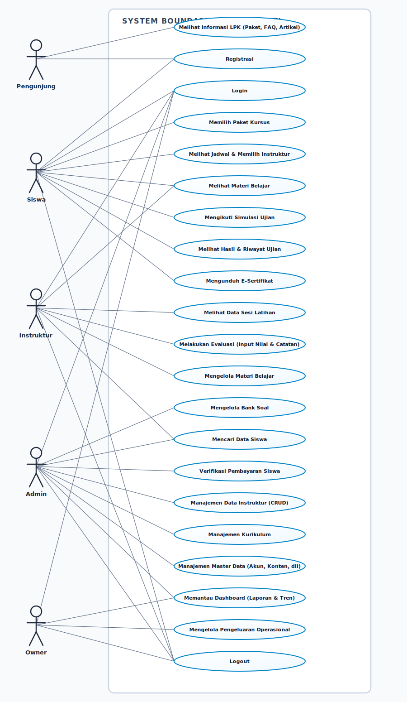

# Use Case Diagram - TriBakti Driving School

Dokumen ini berisi representasi **Use Case Diagram** untuk sistem **TriBakti Driving School (LPK TriBakti)** yang dianalisis dari alur bisnis aplikasi nyata.

Dokumen ini menyediakan:
1. **Diagram Visual High-Fidelity (Vector SVG)** yang dapat dibuka langsung di browser/di-print.
2. **Diagram Naskah Mermaid (Flowchart)** yang dirender otomatis oleh VS Code/GitHub.
3. **Deskripsi Aktor & Use Case** untuk mempermudah pemahaman alur kerja sistem.

---

## 1. Diagram Visual Use Case (SVG)
Berikut adalah diagram visual yang menunjukkan hubungan aktor (Pengunjung, Siswa, Instruktur, Admin, Owner) dengan 21 use case utama di dalam batasan sistem (system boundary) LPK TriBakti:

---

## 2. Diagram Naskah Mermaid (Flowchart)
Diagram berikut dirender langsung menggunakan **Mermaid Flowchart** dengan tata letak aktor di sisi kiri/kanan dan Use Case oval di bagian tengah:

```mermaid
flowchart LR
    %% Style Definitions
    classDef actor fill:#f8fafc,stroke:#1e293b,stroke-width:2px,color:#1e293b,rx:20px;
    classDef usecase fill:#ffffff,stroke:#0b6e99,stroke-width:2px,color:#0f172a,rx:15px;
    classDef boundary fill:#ffffff,stroke:#94a3b8,stroke-dasharray: 5 5;

    %% Actors
    subgraph Aktor_Pengunjung ["👤 Pengunjung"]
        Pengunjung((Pengunjung)):::actor
    end

    subgraph Aktor_Siswa ["👤 Siswa"]
        Siswa((Siswa)):::actor
    end

    subgraph Aktor_Instruktur ["👤 Instruktur"]
        Instruktur((Instruktur)):::actor
    end

    subgraph Aktor_Admin ["👤 Admin"]
        Admin((Admin)):::actor
    end

    subgraph Aktor_Owner ["👤 Owner"]
        Owner((Owner)):::actor
    end

    %% System Boundary
    subgraph Batasan_Sistem ["🏢 LPK TriBakti System"]
        UC1(["Melihat Informasi LPK <br> Paket, FAQ, Artikel"]):::usecase
        UC2(["Registrasi"]):::usecase
        UC3(["Login"]):::usecase
        UC4(["Memilih Paket Kursus"]):::usecase
        UC5(["Melihat Jadwal & Memilih Instruktur"]):::usecase
        UC6(["Melihat Materi Belajar"]):::usecase
        UC7(["Mengikuti Simulasi Ujian"]):::usecase
        UC8(["Melihat Hasil & Riwayat Ujian"]):::usecase
        UC9(["Mengunduh E-Sertifikat"]):::usecase
        UC10(["Melihat Data Sesi Latihan"]):::usecase
        UC11(["Melakukan Evaluasi <br> Input Nilai & Catatan"]):::usecase
        UC12(["Mengelola Materi Belajar"]):::usecase
        UC13(["Mengelola Bank Soal"]):::usecase
        UC14(["Mencari Data Siswa"]):::usecase
        UC15(["Verifikasi Pembayaran Siswa"]):::usecase
        UC16(["Manajemen Data Instruktur (CRUD)"]):::usecase
        UC17(["Manajemen Kurikulum"]):::usecase
        UC18(["Manajemen Master Data"]):::usecase
        UC19(["Memantau Dashboard <br> Laporan & Tren"]):::usecase
        UC20(["Mengelola Pengeluaran Operasional"]):::usecase
        UC21(["Logout"]):::usecase
    end

    %% Pengunjung Connections
    Pengunjung --- UC1
    Pengunjung --- UC2

    %% Siswa Connections
    Siswa --- UC2
    Siswa --- UC3
    Siswa --- UC4
    Siswa --- UC5
    Siswa --- UC6
    Siswa --- UC7
    Siswa --- UC8
    Siswa --- UC9
    Siswa --- UC21

    %% Instruktur Connections
    Instruktur --- UC3
    Instruktur --- UC6
    Instruktur --- UC10
    Instruktur --- UC11
    Instruktur --- UC12
    Instruktur --- UC14
    Instruktur --- UC21

    %% Admin Connections
    Admin --- UC3
    Admin --- UC13
    Admin --- UC14
    Admin --- UC15
    Admin --- UC16
    Admin --- UC17
    Admin --- UC18
    Admin --- UC19
    Admin --- UC21

    %% Owner Connections
    Owner --- UC3
    Owner --- UC19
    Owner --- UC20
    Owner --- UC21
```

---

## 3. Deskripsi Aktor & Hak Akses
Terdapat 5 Aktor utama yang berinteraksi dengan sistem TriBakti Driving School:

1. **Pengunjung (Visitor)**:
   * Pengguna umum internet yang belum mendaftar.
   * Hak akses meliputi: melihat halaman depan (landing page), ulasan siswa, daftar paket belajar, artikel blog, daftar FAQ, serta melakukan pendaftaran akun baru (registrasi).

2. **Siswa (Siswa)**:
   * Pengguna terdaftar yang merupakan siswa aktif di LPK TriBakti.
   * Hak akses meliputi: melakukan login, memilih paket kursus mengemudi, memesan jadwal latihan dan memilih instruktur, melihat materi pelajaran teori/video belajar, mengikuti ujian simulasi teori, melihat riwayat skor nilai ujian, mengunduh sertifikat kelulusan digital, dan logout.

3. **Instruktur (Pengajar)**:
   * Pengajar profesional yang memberikan bimbingan teori dan praktik.
   * Hak akses meliputi: login, melihat jadwal latihan siswa bimbingannya, mengisi evaluasi pertemuan (memberikan skor nilai dan catatan kemajuan siswa), mengunggah/mengelola materi pembelajaran online, mencari data rekap progres siswa, dan logout.

4. **Admin (Staf LPK)**:
   * Pengelola harian operasional LPK TriBakti.
   * Hak akses meliputi: login, verifikasi dan konfirmasi bukti pembayaran pendaftaran siswa, mengelola data instruktur (tambah, edit, hapus), mengelola master bank soal ujian, mengelola kurikulum belajar, mengelola master data konten website (FAQ, artikel, testimony), mencari data progres siswa, memantau grafik dashboard, dan logout.

5. **Owner (Pemilik LPK)**:
   * Pemilik bisnis LPK TriBakti yang memantau profitabilitas dan finansial.
   * Hak akses meliputi: login, mengakses dashboard analitik (laporan tren pendaftaran dan pendapatan bisnis), mengelola pengeluaran operasional sekolah (bensin, servis, dll), memantau data slip gaji instruktur, dan logout.
